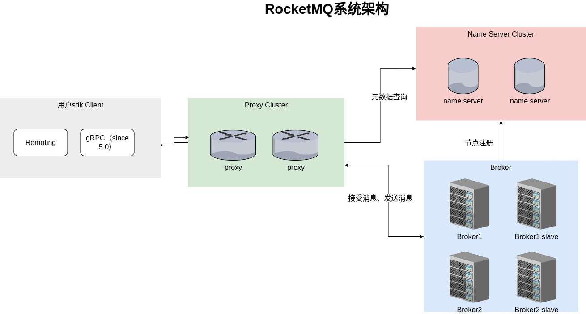
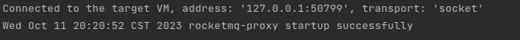

# RocketMQ源码结构与运行

## 简介

RocketMQ孕育于阿里巴巴，现在算是国内业务功能消息队列的首选了。
这首先因为它服务于很多厂的大流量线上，同时它提供如普通消息、延迟消息、顺序消息、死信队列等一系列功能，它号称是金融级别的业务消息队列首选。

RocketMQ 4架构简单，功能丰富，且拓展性良好。RocketMQ 5加入了Proxy、等一系列组件，协议也换成了GRPC，但也向下兼容。
下面我们来一一分析。

## 架构

RocketMQ 5.0的架构整理如下：



## 源码结构及运行

打开[rocketmq](https://github.com/apache/rocketmq)源码，我们可以看到如下目录，我做了些注释做简单讲解，省略了部分我认为不重要目录。
````
rocketmq
├── acl acl权限控制，根据accessKey、accessSecret、sign去做访问控制。
├── bazel 
├── broker broker。
├── client remoting协议的client sdk。
├── common 工具类库模块。
├── container 
├── controller 支持自动切换主从的模块，内嵌在name srv里。
├── distribution 打包发布的模块。
├── docs 文档。
├── example 例子。
├── filter 
├── namesrv namesrv。
├── openmessaging openmessaging支持。
├── proxy 代理设置。
├── remoting remoting协议。
├── srvutil 也是一个工具类库。
├── store 是broker和tieredstore的底层存储依赖，做数据存储。
├── tieredstore
├── tools 
````

### broker启动

RocketMQ的源码启动，需要做些配置，特此记录下。（我采用的是单broker、proxy、单namesrv部署测试方式）。

我采用proxy、broker内嵌的方式启动。

打开**Proxy**目录，通过IDEA设置：
* workdir=xxx/rocketmq/proxy 
* env变量设置：ROCKETMQ_HOME=xxx/rocketmq

将distrubution的conf目录复制到RocketMQ_HOME，
在复制好的conf目录增加test目录，增加如下文件，
````json title="rmq-proxy-p1.json"
{
  "rocketMQClusterName": "DefaultCluster",
  "namesrvAddr": "127.0.0.1:9876",
  "grpcServerPort": 8091,
  "remotingListenPort": 8090
}
````

````conf title="broker-c-n1.conf"
brokerClusterName = DefaultCluster
brokerName = broker-a
brokerId = 0
deleteWhen = 04
fileReservedTime = 48
brokerRole = ASYNC_MASTER
flushDiskType = ASYNC_FLUSH

#enableControllerMode = true
#fetchNamesrvAddrByAddressServer = true
#fetchControllerAddrByDnsLookup = true
#controllerAddr = 127.0.0.1:9870;127.0.0.1:9871;127.0.0.1:9872
#namesrvAddr = 127.0.0.1:9000;127.0.0.1:9001;127.0.0.1:9002
namesrvAddr = 127.0.0.1:9876

allAckInSyncStateSet=true
listenPort=30911

#storePathRootDir=/home/work/xxx

autoCreateTopicEnable=false
autoCreateSubscriptionGroup=false
enablePropertyFilter=true
slaveReadEnable=true
waitTimeMillsInSendQueue=1000
````

最后增加启动参数：`-bc xxx/rocketmq/conf/test/broker-c-n1.conf -pc xxx/rocketmq/conf/test/rmq-proxy-p1.json -pm Local`

启动成功：  



### namesrv启动

嗯namesrv的启动就简单了：

IDEA启动页
* 增加env参数：ROCKETMQ_HOME=xxx/rocketmq
* workdir设置为xxx/rocketmq/namesrv

启动成功：  


## 发消息验证

通过GRPC client sdk发送消息：

````
send:   
20:25:16.523 [main] INFO net.teaho.demo.rocketmq.javacli.NormalMsgTest - Send message successfully, message=SendReceiptImpl{messageId=01000EC6786F52C38205382E2C00000000}

receive:  
20:25:24.429 [RocketmqMessageConsumption-0-17] INFO net.teaho.demo.rocketmq.javacli.NormalMsgTest - Consume body=This is a normal message for Apache RocketMQ, message=MessageViewImpl{messageId=01000EC6786F52C38205382E2C00000000, topic=TopicTest, bornHost=teaho-RedmiBook-Pro-15, bornTimestamp=1697027116394, endpoints=ipv4:10.235.60.170:8091, deliveryAttempt=1, tag=TagA, keys=[yourMessageKey-1c151062f96e], messageGroup=null, deliveryTimestamp=null, properties={}}

````

